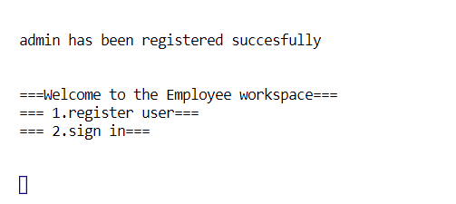
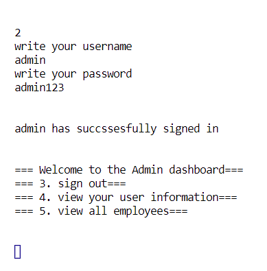

# Welcome to the employee user system.
This is a console application that allows an employee to log in to the company system and see their user information. In the future there will be more you can do such as clocking in and clocking out, see your salary, take a PTO and much more.
 
# How to install
There are two ways to install the application
  1. Download the repository as a zip file, then extract it to the folder you want it to be.
  2. Clone the application.  
   
# Start the app
  1. Once the app is downloaded, navigate to [App.java](src/controller/App.java) (src/controller/App.java), and press **run**.
  2. The application will run in your command line/ terminal
     1. An admin user will be created by default in [App.java](src/controller/App.java). Feel free to remove it if you like.
  3. You will see this in the terminal once the application starts.
     1. 
  4. Press "1" and `enter` to register a user, then follow the instructions of the information that you need to add. Press "2" to sign in an existing member, and do likewise.
  5. An admin user is created by default. An admin user has more privileges than a normal user. To sign into the user write "admin" as the username and the "admin123" for the password. It should look like this when finished.
     1. 
  6. Press the numbers shown in the console, to execute certain commands.
 
  Make an issue on github if there are any bugs you would like to report. Thank you.
