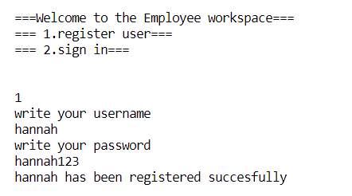

| test nr | Vad som testas/krav  | Hur det testas | Testresultat |
| --- | --- | --- | --- |
| 1 | Registrera en användare  | Skriver du “1” i terminalen kan du registrera en användare. Då kan du skriva ett användarnamn och ett lösenord  |  |
| 2 | Registrera en användare som redan finns  |  |  |
| 3 | Logga in en användare |  |  |
| 4 | Logga in en användare som inte finns |  |  |
|  | Logga in en användare med fel användarnamn |  |  |
|  | Logga in en användare som finns, med fel lösenord  |  |  |
|  | Logga en som en vanlig användare |  |  |
|  | Logga in som admin |  |  |
|  | visa användare information |  |  |
|  | logga ut en användare  |  |  |
|  | visa ala registered användare, när man är inloggad som admin |  |  |