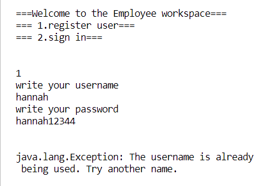
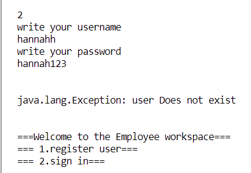

| test nr | Vad som testas/krav  | Hur det testas | Testresultat |
| --- | --- | --- | --- |
| 1 | Registrera en användare  | Skriv  “1” i terminalen för att registrera en användare. Då kan du skriva ett användarnamn “hannah” och ett lösenord “hannah123”.  |  |
| 2 | Registrera en användare som redan finns  | Skriv “1” i terminalen för att registrera en användare. Använd samma uppgifter som i test 1. Detta ska inte fungera för att man kan inte ha en användare med samma namn. |  |
| 3 | Logga in en användare | Skriv “2” i terminalen för att logga in en användare.  Ange uppgifterna från test 1. |  |
| 4 | Logga in en användare som inte finns | Skriv “2” i terminalen för att logga in en användare.  Ange felaktiga uppgifter som du vet inte finns. |  |
| 5 | Logga in en användare med fel användarnamn | Skriv “2” i terminalen för att logga in en användare. Ange felaktiga uppgifter för användarnamnet, men använd lösenordet från test 1. |  |
| 6 | Logga in en användare som finns, med fel lösenord  | Skriv “2” i terminalen för att logga in en användare. Ange felaktiga uppgifter för lösenordet, men använd användarnamnet från test 1. |  |
| 7 | Logga in som en vanlig användare | Använd uppgifterna från test 1 för att logga in en användare. Om allt stämmer, så kommer du komma till en sida som heter “user Dashboard” |  |
| 8 | Logga in som admin | Ange “admin” som användare namn och “admin123”, som lösenord. Då kommer du till en sida som heter “Admin Dahsboard” |  |
| 9 | Visa användare information | Efter du har loggat in med uppgifterna av en registrerad användare, skriv “4” i terminalen för att see dina användare uppgifter. |  |
| 10 | logga ut en användare  | Efter du har loggat in med uppgifterna av en registrerad användare, skriv “3” i terminalen för att logga ut. Efter det kommer du till startsidan. |  |
| 11 | Visa alla registered användare, när man är inloggad som admin | Logga in som admin (med uppgifterna i test 8), sedan skriv “5” i terminalen, för att se uppgifter på alla registrerade användare. |  |